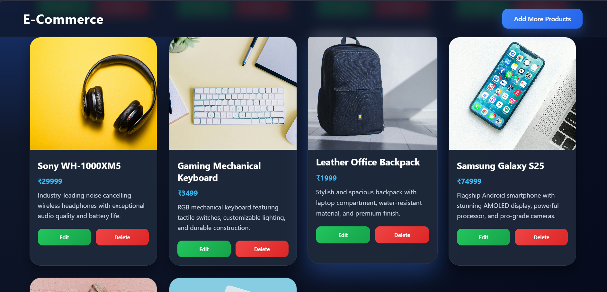
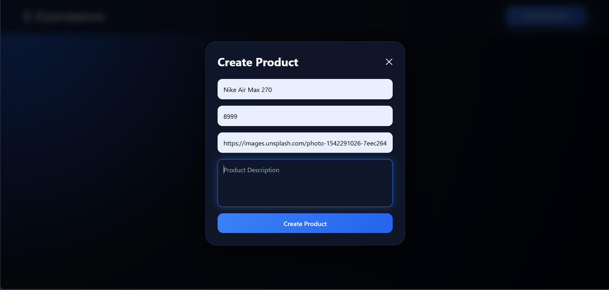
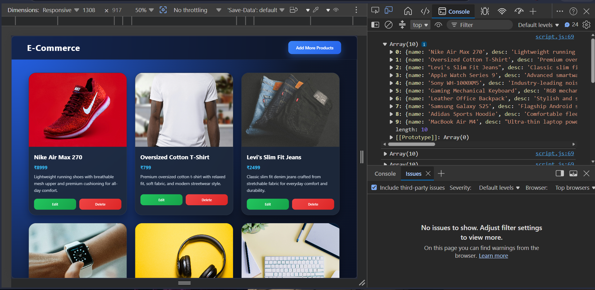
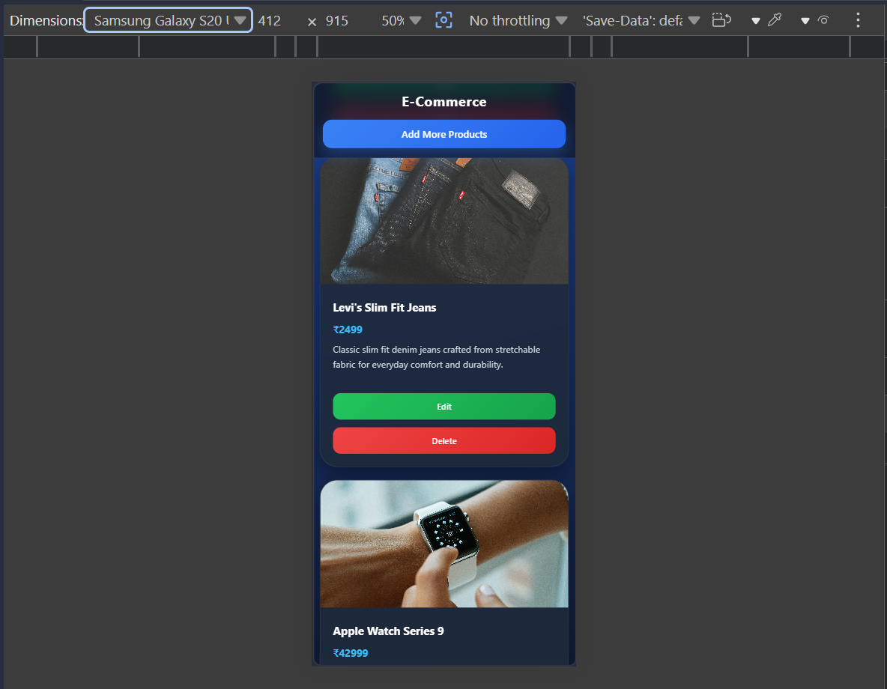

# 🛒 E-Commerce CRUD Project

A modern E-Commerce Product Management application built using **HTML, CSS, and Vanilla JavaScript**.

This project helped me strengthen my understanding of **DOM Manipulation**, **CRUD Operations**, **Form Handling**, **Arrays**, **Objects**, and **Dynamic UI Rendering** using pure JavaScript.

---

## 🚀 Features

### Product Management

* ✅ Create Products
* ✅ Read Products
* ✅ Update Products
* ✅ Delete Products

### Form Handling

* ✅ Form Validation
* ✅ Empty Input Prevention
* ✅ Space Validation using `trim()`
* ✅ Auto Form Reset
* ✅ Auto Close Form after Submit

### Dynamic UI

* ✅ Dynamic Product Cards
* ✅ Real-Time Rendering
* ✅ Responsive Grid Layout
* ✅ Edit Existing Products
* ✅ Delete Products Instantly

### Modern UI

- ✅ Dark Theme
- ✅ Glassmorphism Effects
- ✅ Hover Animations
- ✅ Smooth Transitions
- ✅ Card Animations
- ✅ Modern Popup Form
- ✅ Mobile Responsive Design
- ✅ Tablet Responsive Design
- ✅ Desktop Responsive Design

---

## 🛠️ Technologies Used

### Frontend

* HTML5
* CSS3
* JavaScript (ES6)

### JavaScript Concepts Used

* DOM Selection
* Event Handling
* addEventListener()
* preventDefault()
* Arrays
* Objects
* Functions
* forEach()
* find()
* findIndex()
* splice()
* Template Literals
* Dynamic Rendering
* CRUD Operations

---

## 📂 Project Structure

```bash
project-folder/
│
├── index.html
├── style.css
├── script.js
└── README.md
```

---

## 📋 CRUD Workflow

### Create

```javascript
productsArr.push(obj);
```

Adds a new product into the array.

---

### Read

```javascript
ui();
```

Renders all products dynamically using:

```javascript
forEach()
```

and

```javascript
innerHTML
```

---

### Update

```javascript
find()
findIndex()
```

Used to locate the selected product and update it.

---

### Delete

```javascript
splice()
```

Removes a selected product from the array and re-renders the UI.

---

## 🎯 What I Learned

Through this project I learned:

* Building complete CRUD applications
* Working with Arrays and Objects
* Dynamic UI Rendering
* Form Validation
* Update and Delete Logic
* DOM Manipulation
* Event Handling
* JavaScript Project Structure
* Debugging Real-World Problems

---

## 📸 Project Screenshots

### Home Page




### Product Form




### Product Console



### Responsive



---

## 🔮 Future Improvements

* Local Storage Support
* Product Search
* Product Categories
* Product Filtering
* Product Sorting
* Product Count
* Dark / Light Mode
* Backend Integration
* Database Connectivity

---

### Responsive Design

- ✅ Mobile Responsive
- ✅ Tablet Responsive
- ✅ Desktop Responsive
- ✅ Responsive Grid Layout
- ✅ Responsive Product Cards
- ✅ Responsive Popup Form

---

## 👨‍💻 Author

**Shikhar Mishra**

B.Tech CSE'29 @ CGC University Mohali

Currently Learning:

* JavaScript
* DOM Manipulation
* Git & GitHub
* MERN Stack

---

⭐ If you like this project, consider giving it a star.
